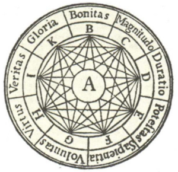

# El llenguatge de programació Llull

Aquesta pàgina descriu la segona pràctica de GEI-LP (edició 2021-2022 Q1). La vostra tasca és implementar un intèrpret i un *pretty-printer* per a un llenguatge de programació anomenat Llull.


## Història

Ramon Llull, nascut a Mallorca cap al 1232, és considerat un profeta de la informàtica. La seva teoria era que la veritat podia ser automatitzada i, que mitjançant una fórmula, es podia demostrar l'existència de Déu (i de totes les altres veritats). El seu pla per convertir als infidels al cristianisme era presentar-los una lògica que no podrien refutar. El llenguatge de programació Llull és una eina més en aquesta direcció 🤣.

## Fonètica

Llull es pronuncia [ˈʎuʎ].


## Presentació del llenguatge Llull

El llenguatge de programació Llull té un aspecte semblant al C, però amb nombroses simplificacions perquè els profans i els infidels el puguin entendre i utilitzar.

Aquest és el *Hello World* en Llull:

```
# Hello World en Llull

void main() {
    write("El Primer dia: Déu creà la llum")
}

```

Com podeu veure, Llull disposa d'accions definides amb `void` (però no té funcions) i ofereix una instrucció d'escriptura `write`. Els textos s'escriuen entre cometes dobles, però només es poden utilitzar dins dels `write`s. Els comentaris comencen amb `#` i acaben al final de la seva línia.

El següent programa mostra com llegir dos nombres i calcular el seu màxim comú divisor utilitzant l'algorisme d'Euclides amb dos procediments i entrada/sortida:

```
void main() {
    # llegeix dos enters i  n'escriu el seu maxim comu divisor
    write("Escriu dos nombres")
    read(a)
    read(b)
    write("El seu MCD es")
    euclides(a, b)
}

void euclides(a, b) {
    while (a <> b) {
        if (a > b) {
            a = a - b
        } else {
            b = b - a
        }
    }
    write(a)
}
```

Les variables són locals a cada invocació de cada procediment i els procediments es poden comunicar a través de paràmetres. Els procediments llisten els noms dels seus paràmetres formals, però no inclouen els seus tipus.

Les variables no han de ser declarades, i poden ser de tipus enter o taula d'enters (*array*).

Com es veu a l'exemple, la sintaxi per llegir i escriure és utilitzant `read` i `write` respectivament. Les instruccions no es separen ni acaben amb punts i comes superflus, això només ho necessiten els LPs dels descreguts. A més, fixeu-vos que Llull utilitza l'autèntic operador de diferència que el beat va introduir a la seva *Ars Magna* i  que mai s'hauria d'haver abandonat: el `<>`.

L'exemple següent il·lustra l'ús de taules per trobar la llista dels nombres
primers:

```
void main() {
    read(n)
    array(p, n + 1) # crea un array [0 .. n] inicialitzant totes les posicions a zero
    write(p)
    eratostenes(p, n)
    write(p)
    for (i = 2; i <= n; i = i + 1) {
        if (get(p, i) == 1) {
            write(i)
        }
    }
}

void eratostenes(p, n) {
    set(p, 0, 0)
    set(p, 1, 0)
    for (i = 2; i <= n; i = i + 1) {
        set(p, i, 1)
    }
    for (i = 2; i * i <= n; i = i + 1) {
        if (get(p, i) == 1) {
            for (j = i + i; j <= n; j = j + i) {
                set(p, j, 0)
            }
        }
    }
}
```

Si li donem `20` com a entrada, la sortida és

```
[0, 0, 0, 0, 0, 0, 0, 0, 0, 0, 0, 0, 0, 0, 0, 0, 0, 0, 0, 0, 0]
[0, 0, 1, 1, 0, 1, 0, 1, 0, 0, 0, 1, 0, 1, 0, 0, 0, 1, 0, 1, 0]
2
3
5
7
11
13
17
19
```

La creació de taules es fa amb la paraula clau `array`, la consulta
amb `get` i la modificació amb `set` (l'operació d'indexació era considerada una blasfèmia a l'època d'en Ramon).

Per tal de plaure a Déu, el llenguatge de programació Llull compta amb recursivitat. Aquest programa mostra com solucionar el problema de les Torres de Hanoi:

```
void main() {
    read(n)
    hanoi(n, 1, 2, 3)
}

void hanoi(n, ori, dst, aux) {
    if (n > 0) {
        hanoi(n - 1, ori, aux, dst)
        write(ori, "->", dst)
        hanoi(n - 1, aux, dst, ori)
    }
}
```

Amb l'entrada `3` la sortida és:

```
1 -> 2
1 -> 3
2 -> 3
1 -> 2
3 -> 1
3 -> 2
1 -> 2
```


# La vostra feina

La vostra feina consisteix en:

1. Implementar un intèrpret de Llull.
2. Implementar un *pretty-printer* per a Llull.

Per realitzar la vostra feina heu d'utilitzar Python
i ANTLR4, tal com s'ha explicat a les classes de laboratori.


# Especificació de Llull

Les instruccions de Llull són:

- l'assignació amb `=`,
- la lectura amb `read()`,
- l'escriptura amb `write()`,
- el condicional amb `if` i potser `else`,
- la iteració amb `while`,
- la iteració amb `for`,
- la invocació a un procediment i,
- instruccions d'accés a taules (*arrays*).

Les instruccions escrites una rera l'altra s'executen seqüencialment.


## Assignació

L'assignació ha d'avaluar primer l'expressió a la part dreta del `=` i emmagatzemar després el resultat a la variable local a la part esquerra. Exemple: `a = a - b`. En el cas d'assignar taules, cal copiar els valors (sense fer aliasing).


## Lectura

La instrucció de lectura ha de llegir un valor enter del canal d'entrada estàndard i enmagatzemar-lo a la variable dins del `read()`. Exemple: `read(x)`.


## Escriptura

La instrucció d'escriptura ha d'avaluar l'expressió dins del `write` i escriure-la, en una línia, al canal de sortida estàndard. Exemple: `write(x)`. En el cas d'escriure una taula, cal escriure tots els seus valors entre claudàtors i separats per comes. `write()` pot contenir diversos paràmetres, cal escriure cadascun d'ells a la mateix línia, separats per espais. Els paràmetres poden contenir textos (tancats entre cometes dobles, que apropen més el creient a Déu que les cometes simples).


## Condicional

La instrucció condicional té la semàntica habitual. El bloc `else` és optatiu. Exemples: `if (x == y) {z = 1}` i `if (x == y) {z = 1} else { z := 2 }`. Fixeu-vos que les claus dels blocs sempre són obligatòries (tant als condicions com als procediments, els `while`s i els `for`s).


## Iteració amb `while`

La instrucció iterativa amb `while` té la semàntica habitual.
Exemple: `while (a > 0) { a = a / 2 }`.


## Iteració amb `for`

La instrucció iterativa amb `for` té la semàntica habitual en C.
Exemple: `for (i = 1; i <= n; i = i + 1) { write(i * 10) }`.


## Invocació de procediment

La crida a un procediment té la semàntica habitual.  Els paràmetres enters es passen
per valor, avaluant les expressions dels paràmetres d'esquerra a dreta. Les taules
es passen per referència.
Si el nombre de paràmetres passats
no corresponen als declarats, es produeix un error. Els procediments no són
funcions i no poden retornar resultats. Però els procediments es poden cridar
recursivament.
Exemple: `escriu(numero, 2)`.


## Expressions

Si una variable encara no ha rebut cap valor, el seu valor és zero. Els
operadors aritmètics són els habituals (`+`, `-`, `*`, `/`, `%`) i amb la mateixa
prioritat que en C. Evidentment, es poden usar parèntesis. El
operadors relacionals (`==`, `<>`, `<`, `>`, `<=`, `>=`) retornen zero per
fals i u per cert (Boole és posterior a Llull). Les taules no es poden operar.


## Taules

La creació de taules es fa amb la paraula clau `array`, que crea en el seu primer paràmetre una taula amb tants enters inicialitzats a zero com indiqui el segon paràmetre. Les taules comencen a l'índex zero. Així, `array(t, n)` crea una taula `[0..n-1]` amb `n` zeros. La consulta d'una taula es fa amb un `get`: `get(t, i)` retorna el valor a la posició `i` de la taula `t`. Igualment, la modificació d'una posició d'una taula es fa amb un `set`: `set(t, i, x)` fixa a `x` el valor a la posició `i` de la taula `t`. Les taules es passen per referència.


## Àmbit de visibilitat

No importa l'ordre de declaració dels procediments. Les variables són locals a
cada invocació de cada procediment. No hi ha variables globals ni manera
d'accedir a variables d'altres procediments (només a través dels paràmetres).


## Errors

Malgrat que Llull és força senzill, els programes poden causar molts errors en temps d'execució. Per aquesta pràctica, només us demanem que detecteu els errors més verosímils (divisió per zero, crida a procediment no definit, repetició de procediment ja definit, nombre de paràmetres incorrectes, noms de paràmetres formals repetits, accés a un índex inesxistent d'una taula...) i que el programa llanci amb una excepció quan es donen. No cal que feu una anàlisi semàntica per errors de tipus entre enters i taules.


## Invocació de l'intèrpret

El vostre intèrpret s'ha d'invocar amb la comanda `python3 llull.py` tot
passant-li com a paràmetre el nom del fitxer que conté el codi font
(l'extensió dels fitxers per programes en Llull és `.llull`). Per exemple:

```bash
python3 llull.py programa.llull
```

Els programes poden començar des de qualsevol procediment.  Per defecte, es comença pel procediment `main`. Si es vol començar el programa des d'un procediment diferent de `main()`, cal donar el seu nom com a segon paràmetre i es poden passar els valors dels seus paràmetres (només nombres enters) des de la línia de comandes.

```bash
python3 llull.py programa.llull converteix_infidels 10 20
```


## Invocació del *pretty-printer*

El vostre *pretty-printer* (també anomenat *beatificador* per la semblança amb *beautifier*) s'ha d'invocar amb la comanda `python3 beat.py` tot
passant-li com a primer paràmetre el nom del fitxer que conté el codi font a *beatificar*. Per exemple:

```bash
python3 beat.py programa.llull
```

El *pretty-printer* ha de formatar el codi amb unes regles d'estil semblants a les utilitzades en aquest document i amb uns colors agradables. Per exemple, si el programa fos

```
void hanoi(n,ori,dst,aux)
{    # la n és un real negatiu
    if(n>0){hanoi(n-1,ori,aux,dst)write(ori,"->",dst)hanoi(n-1,aux,
        dst, ori
)}}
```

la sortida hauria de ser aquest programa, elegantment formatat per a major glòria del Creador:

```c
void hanoi(n, ori, dst, aux) {
    if (n > 0) {
        hanoi(n - 1, ori, aux, dst)
        write(ori, "->", dst)
        hanoi(n - 1, aux, dst, ori)
    }
}
```

Fixeu-vos que el *pretty-printer* perd els comentaris, ja que aquests poden amagar la veritat de les Escriptures. També, recordeu que Arnau de Vilanova, mestre de Ramon Llull, ja va demostrar la necessitat d'indentar amb quatre espais.

Els colors o estils dels elements del programe els podeu escollir vosaltres lliurament. Utiliteu alguna llibreria de Python per escriure en colors al terminal.


## Extensions

Podeu extendre el llenguatge amb construccions del vostre gust, a condició de mantenir una compatibilitat estricta amb l'especificació donada (i ser respectuosos amb la teologia de Ramon Llull). A més, cal que documenteu amb precisió les vostres extensions i que creeu programes que les provin i posin de manifest la seva utilitat.

Per exemple, podríeu extendre Llull amb variables i/o constants globals, operadors lògics, funcions que retornin valors, ...

Compte: Les extensions poden portar molta feina, consulteu-ho abans amb el vostre professor.


# Lliurament

Heu de lliurar la vostra pràctica al Racó. Només heu de lliurar un fitxer ZIP
que, al descomprimir-se generi:

- Un fitxer `README.md` que documenti el vostre projecte.
    - vegeu, per exemple, https://www.makeareadme.com/.

- Un fitxer `requirements.txt` amb les llibreries que utilitza el vostre projecte.
  - vegeu, per exemple, https://pip.pypa.io/en/stable/user_guide/#requirements-files.

- Un fitxer `llull.g4` amb la gramàtica del LP.

- Un fitxer `llull.py` amb el programa de l'intèrpret, incloent els seus visitadors.

- Un fitxer `beat.py` amb el programa del *pretty-printer*, incloent els seus visitadors.

- Si heu fet extensions, podeu afegir fitxers `test-*.llull` com a exemples i jocs de proves.

Els vostres fitxers de codi en Python han de seguir les regles d’estı́l PEP8, tot i que podeu oblidar les restriccions sobre la llargada màxima de les lı́nies. Podeu utilitzar els paquets `pep8` o `autopep8` o http://pep8online.com/ per assegurar-vos que seguiu aquestes regles d’estı́l. L’ús de tabuladors en el codi queda prohibit (zero directe). Els vostres programes en Llull han de seguir l'estil exposat en aquest document, que demostra bon gust i conformança amb les escriptures lul·lianes (és a dir, passeu-los per beatificador).

El termini de lliurament és el **dilluns 10 de gener a les 23:59**.

Per evitar problemes de còpies,
no pengeu el vostre projecte en repositoris públics.


## Llibreries

Utilitzeu  `ANTLR` per escriure la gramàtica i l'intèrpret. Podeu utilitzar lliurament qualsevol estàndard de Python. A més, podeu utilitzar qualsevol llibreria de Python3 per a escriure en colors, a condició que sigui portable entre sistemes, que s'instal·li amb `pip3` i que aparegui al vostre `requirements.txt`.


# Referències

- ANTLR en Python: https://gebakx.github.io/Python3/compiladors.html#1

- Ramon Llull: https://ca.wikipedia.org/wiki/Ramon_Llull


